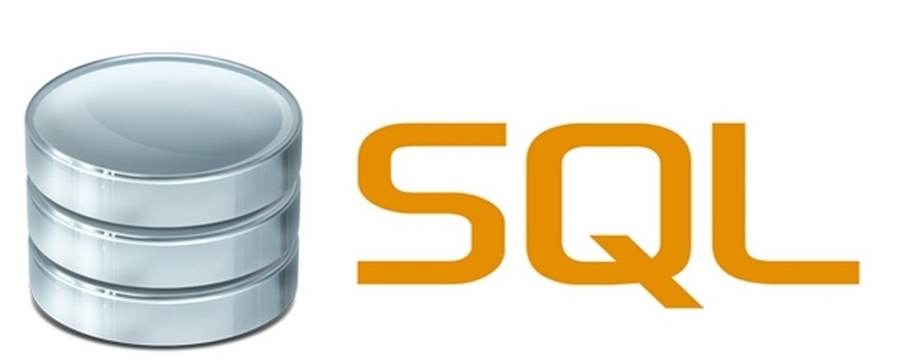

### Hi there 👋

<!--
**ArbeenaKhanum/ArbeenaKhanum** is a ✨ _special_ ✨ repository because its `README.md` (this file) appears on your GitHub profile.

Here are some ideas to get you started:

- 🔭 I’m currently working on ...
- 🌱 I’m currently learning ...
- 👯 I’m looking to collaborate on ...
- 🤔 I’m looking for help with ...
- 💬 Ask me about ...
- 📫 How to reach me: ...
- 😄 Pronouns: ...
- ⚡ Fun fact: ...
-->

##### I am Arbeena Khanum from Bangalore, India. I am an aspiring Android Developer. :woman_technologist:

### Tech & Tools

        

📫 How to reach me?  
Connect with me on **[LinkedIn](https://www.linkedin.com/in/arbeena-khanum-4ab21217a/)**.

💬 Want to know more about me?  
You can check my **[Resume](https://drive.google.com/file/d/1TWReqPj-NgGjFTlGyvH72XkYTlvugFjB/view?usp=sharing)**.
